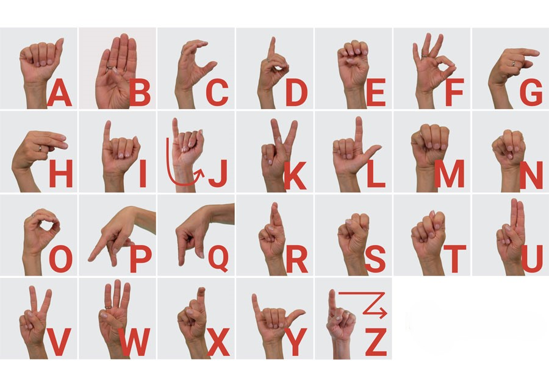

# Real-Time Hand Gesture Recognition for 3D Object Manipulation

## Introduction
This project presents a real-time hand gesture recognition system capable of manipulating 3D objects through intuitive hand gestures. The system leverages computer vision, machine learning, and 3D graphics techniques to provide a natural and immersive user experience.

## Key Features
- **Hand Landmark Detection:** The system uses the MediaPipe library to detect hands in a video feed and extract 21 landmark coordinates for each hand.
- **Machine Learning-based Gesture Recognition:** A machine learning model is trained using the scikit-learn library to classify hand gestures based on the landmark coordinates.
- **3D Object Manipulation:** The recognized hand gestures are translated into corresponding 3D object manipulations, such as rotation and zooming, using the Windows 3D Viewer application.

## Technologies and Platforms
The implementation of the system utilizes the following technologies and platforms:
- OpenCV: For video processing and image manipulation.
- MediaPipe: For hand detection and landmark extraction.
- scikit-learn: For machine learning model training and classification.
- Python: The primary programming language used for the implementation.
- Windows 3D Viewer: For displaying and manipulating 3D objects.

## Dataset
The project uses a publicly available dataset from the GitHub repository KNN Alphabet. This dataset contains labeled hand landmark coordinates for each letter of the American Sign Language (ASL) alphabet, with a total of 24,000 data points.

 

## Demo
Here's a demo of the real-time hand gesture recognition system in action:

## Implementation Details
The implementation of the real-time hand gesture recognition system for 3D object manipulation involves the following key steps:
1. Initializing the MediaPipe hands object for hand detection and landmark extraction.
2. Loading the trained machine learning model for gesture recognition.
3. Creating a normalizer object to standardize the landmark coordinates.
4. Processing each frame of the video feed, detecting hands, and extracting landmark coordinates.
5. Feeding the normalized landmarks into the trained model to predict the corresponding gesture.
6. Performing the appropriate 3D object manipulation based on the predicted gesture.
7. Visualizing the detected hand landmarks on the video frame.
8. Displaying the processed frame and handling user input.

## Performance Evaluation
The system was evaluated based on the following metrics:
- **Gesture Recognition Accuracy:** The trained machine learning model achieved an accuracy of 95.2% in classifying the ASL alphabet gestures.
- **Real-Time Responsiveness:** The system demonstrated robust real-time performance in recognizing hand gestures and translating them into 3D object manipulations.
- **Usability:** The system provided an intuitive and natural interface for 3D object manipulation, enhancing the user experience.

## Challenges and Solutions
The project faced challenges related to lighting conditions, hand orientation, and training dataset quality. Potential solutions include exploring advanced hand detection and tracking techniques, as well as expanding the training dataset and applying data augmentation.

## Future Enhancements
Potential future enhancements for this project include:
- Incorporating more robust hand detection and tracking algorithms to handle varying lighting conditions and hand orientations.
- Expanding the training dataset and exploring advanced deep learning architectures for gesture recognition.
- Integrating support for a wider range of 3D object manipulation techniques, such as scaling and translation.
- Exploring the integration with virtual and augmented reality environments for a more immersive user experience.

## Conclusion
The real-time hand gesture recognition system for 3D object manipulation presented in this project offers a compelling solution for intuitive and natural interaction with digital content. By leveraging computer vision, machine learning, and 3D graphics techniques, the system provides a seamless and engaging user experience, paving the way for innovative applications in various domains.